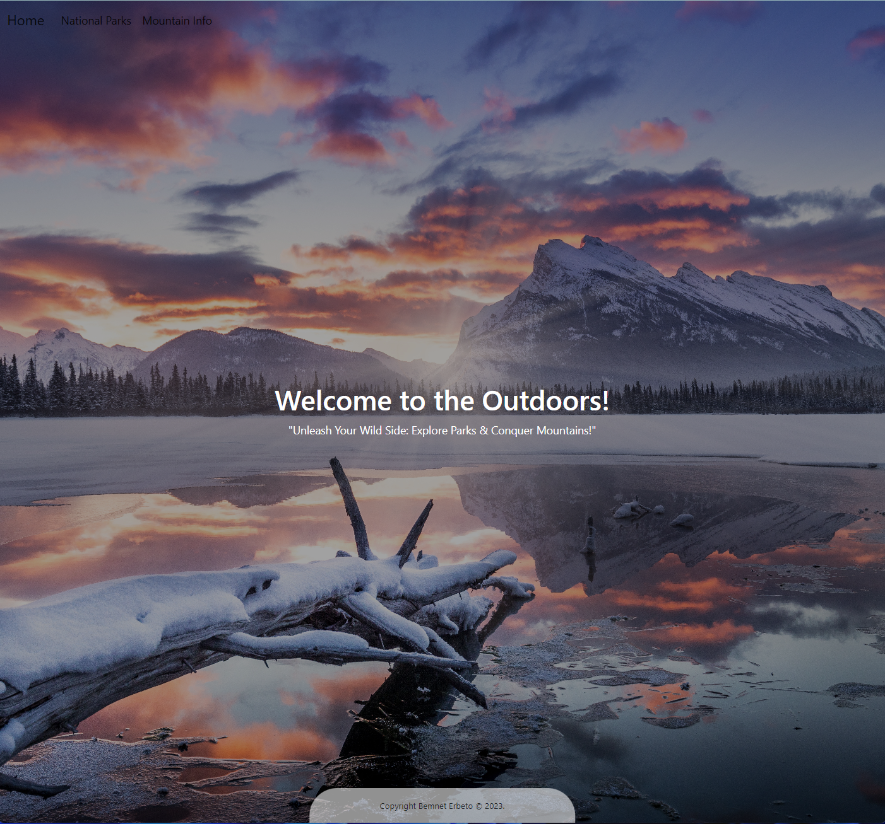
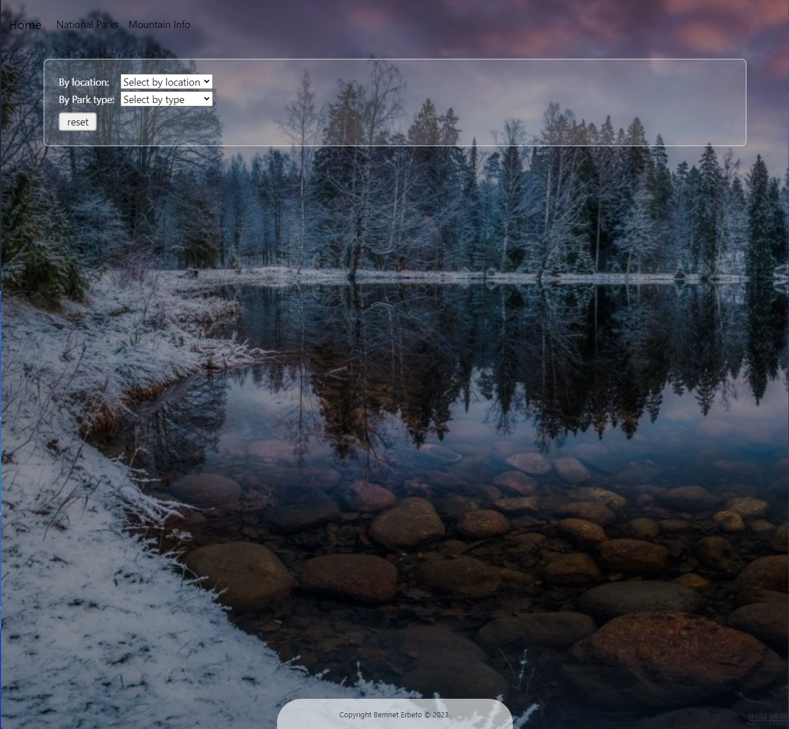
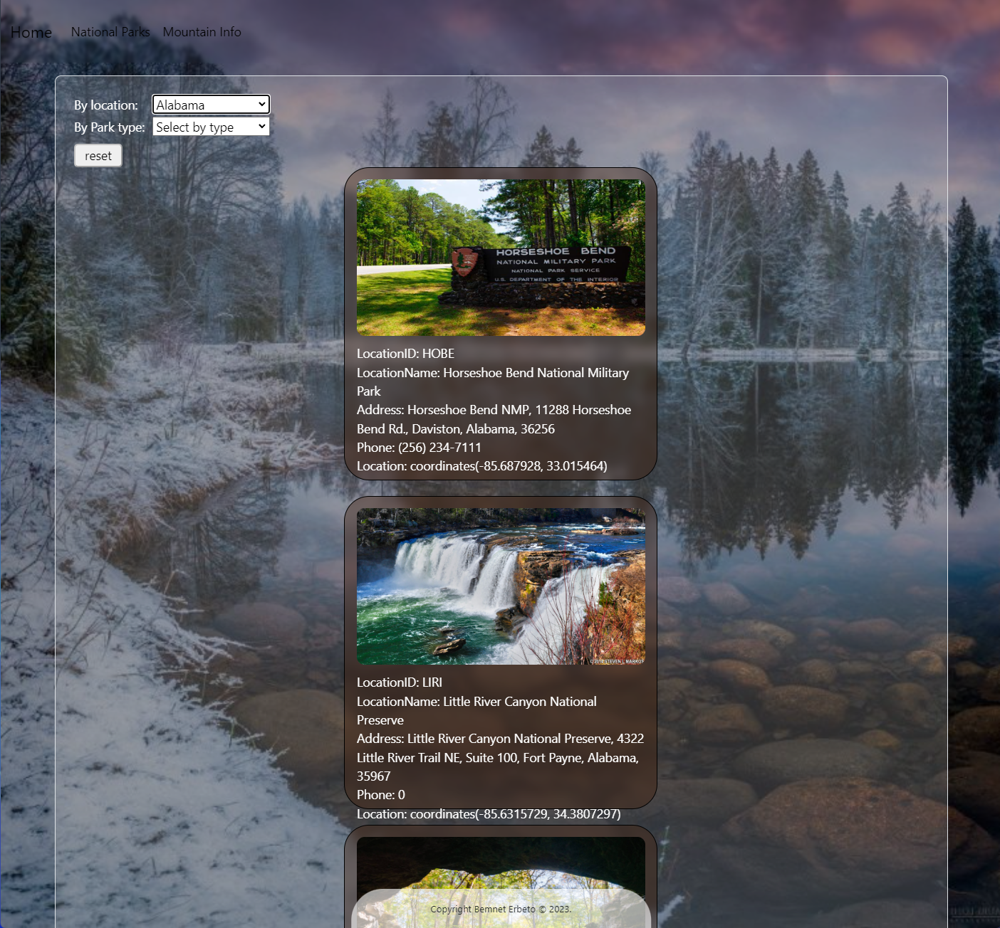
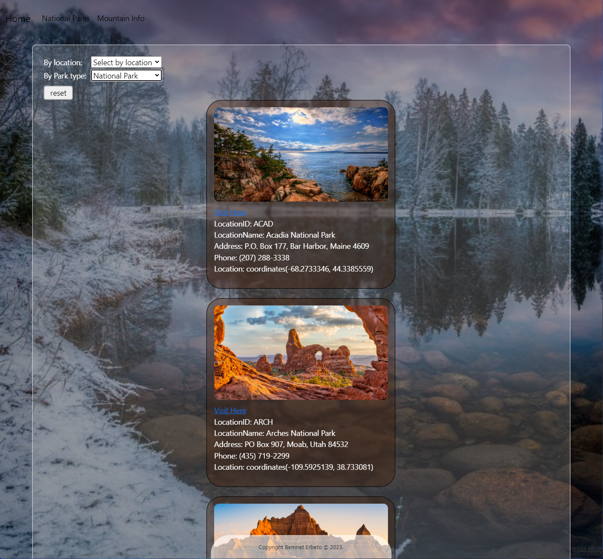
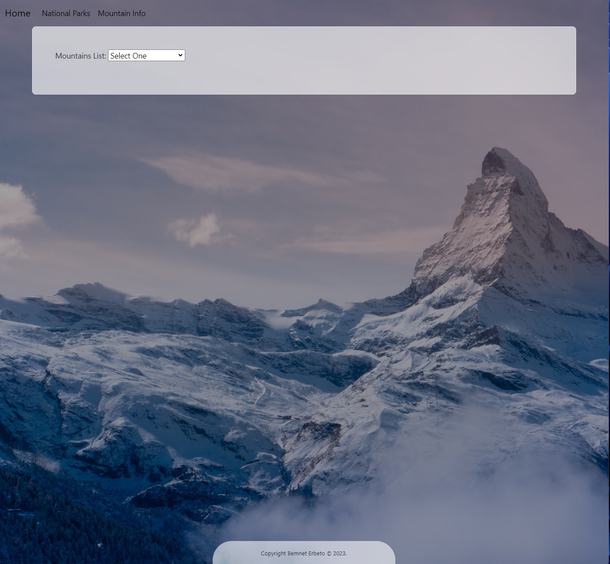
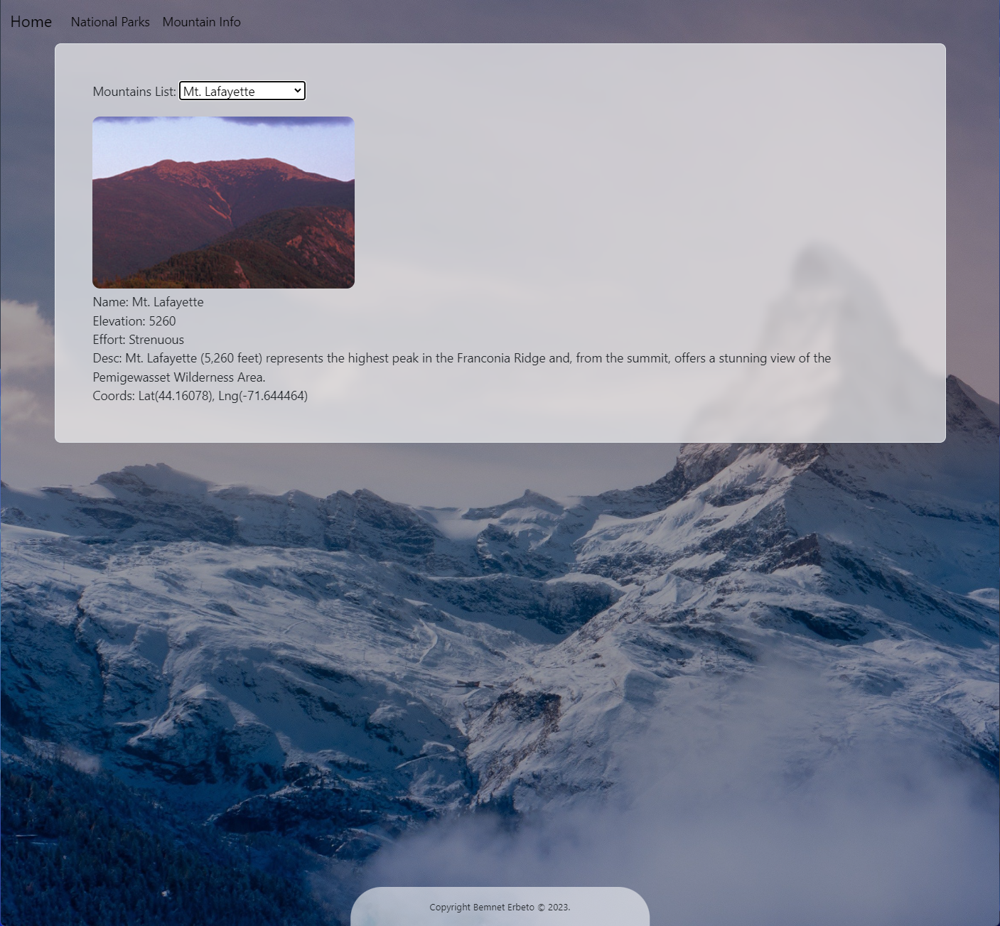

# enjoying-the-outdoors

### Discover and explore the natural wonders of US national parks and mountains with this website! Developed using HTML, CSS, Bootstrap, and Javascript. User-friendly platform features a search engine that allows users to discover outdoor destinations based on location or park type. With three pages including Home, National Park, and Mountains Information, this website provides comprehensive results for parks, offering contact information, location details, captivating images, and additional links for further exploration. 

### Embark on an unforgettable journey through the captivating landscapes of the United States!

### preview: 

